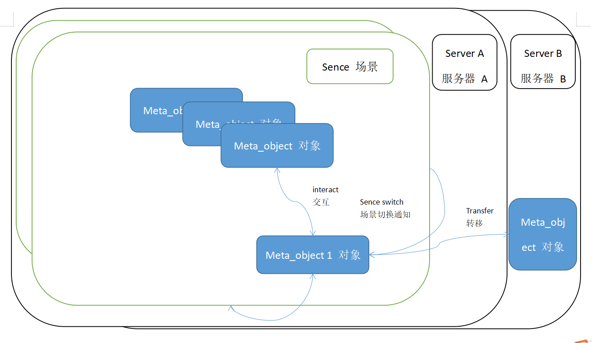
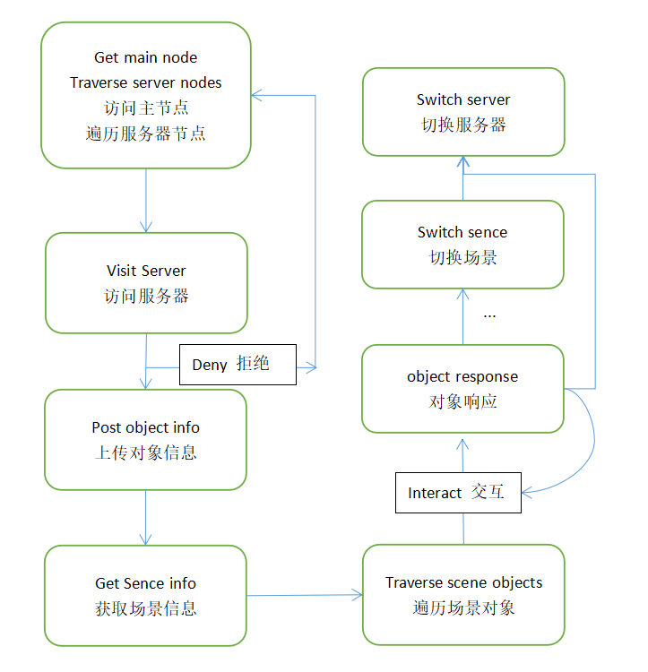

# metaverse_api_server_go

#### 介绍
元宇宙接口 API 服务器 实现。 

The implementation of  [Metaverse standard API 元宇宙接口标准](https://thoughts.aliyun.com/share/6195068ebdc2c4001aea0058#title=Metaverse_standard_API)



<center>Interact relationship 交互关系框图</center>

<br>



<center>Object action flow 对象交互流程</center>

<br>

Introduce 说明：

All json interfaces, fields are usually of type string

所有json接口，字段通常为string类型

<br>

Metaverse basic API interface (you can obtain other node information through this server and traverse the Metaverse):

元宇宙基础API接口（可通过此服务器获取其他节点信息，遍历元宇宙）：

http://42.194.159.204:8081/api

Server open source code: 服务器开源代码：

https://gitee.com/hayoou/metaverse_api_server_go


[API test 1 . API测试 1](http://42.194.159.204:8081/api?do=get_nodes&limit=10&offset=0)


[API test2 Search node. API测试2 搜索节点](http://42.194.159.204:8081/api?do=search_nodes&object_id=&field_name=&meta_api_class_id=meta-api-server&limit=10&offset=0)


Install Server：
安装 golang(https://golang.org/)

Installation: set server port 8081 open

```bash
$ go run metaverse_api_server.go
OR
$ ./buildandrun.sh
```

需要goproxy 代理：

安装：设置服务器 8081 端口开放

windows:

After downloading, press Shift and right-click on the blank space in the folder, open your terminal in the current path and execute

下载后，在文件夹内空白处按 Shift 加右键，在当前路径打开你的终端并执行
```bash
$ go env -w GO111MODULE=on

$ go env -w GOPROXY=https://goproxy.cn,direct

$ go mod tidy

$ go build metaverse_api_server.go 
```
双击生成的exe文件 或者 直接运行：
```bash
$ go run metaverse_api_server.go
```

linux:

设置goproxy
```
$ export GO111MODULE=on

$ export GOPROXY=https://goproxy.cn

$ go mod tidy

$ chmod 777 ./buildandrun.sh

$ ./buildandrun.sh
```